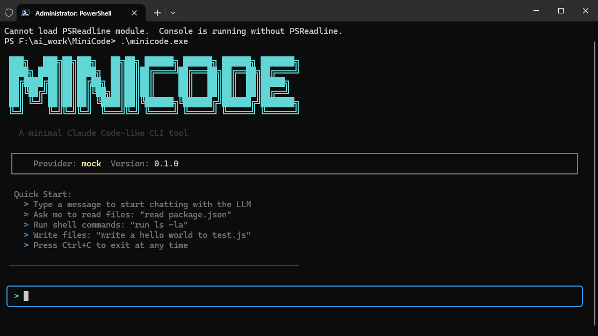

# MiniCode

A minimal, experimental Claude Code-like CLI tool built with TypeScript and Ink.



## Features

- Terminal TUI with rich text rendering and code highlighting
- Streaming LLM responses (typewriter effect)
- Multi-provider support: OpenAI, Anthropic Claude, DeepSeek
- Built-in tools: file read/write, shell commands
- Slash commands: `/help`, `/clear`, `/tools`, `/provider`, `/exit`
- Mock mode for testing without API keys
- Single executable compilation via Bun

## Quick Start

### Install Dependencies

```bash
npm install
```

### Run

```bash
# Mock mode (no API key needed)
MINICODE_PROVIDER=mock npm start

# With real LLM
MINICODE_PROVIDER=deepseek MINICODE_API_KEY=sk-xxx npm start
```

### CLI Options

```bash
minicode [options]

Options:
  -p, --provider <name>  LLM provider (openai|anthropic|deepseek|mock)
  -m, --model <name>     Model name
  -k, --api-key <key>    API key
  -h, --help             display help for command
```

## Configuration

Create a `.env` file in the project root:

```env
# Provider: openai | anthropic | deepseek | mock
MINICODE_PROVIDER=deepseek

# API Key (required for real providers)
MINICODE_API_KEY=sk-xxx

# Model (optional, has defaults per provider)
MINICODE_MODEL=deepseek-chat

# Base URL (optional, for OpenAI-compatible providers)
MINICODE_BASE_URL=https://api.deepseek.com

# System prompt (optional)
MINICODE_SYSTEM_PROMPT=You are a helpful coding assistant.

# Max tokens (optional, default 4096)
MINICODE_MAX_TOKENS=4096
```

### Supported Providers

| Provider | Default Model | Base URL |
|----------|--------------|----------|
| `openai` | gpt-4o | https://api.openai.com/v1 |
| `anthropic` | claude-sonnet-4-20250514 | - |
| `deepseek` | deepseek-chat | https://api.deepseek.com |
| `mock` | - | - |

## Slash Commands

Type `/` to open the command menu:

| Command | Alias | Description |
|---------|-------|-------------|
| `/help` | `/h` | Show available commands |
| `/clear` | `/c` | Clear conversation history |
| `/tools` | `/t` | List available tools |
| `/provider` | `/p` | Show current provider info |
| `/exit` | `/q` | Exit MiniCode |

## Built-in Tools

| Tool | Description |
|------|-------------|
| `file_read` | Read file contents |
| `file_write` | Write/create files |
| `shell` | Execute shell commands |

## Build Single Executable

### Using Bun (Recommended)

```bash
# Install Bun
# Windows: powershell -c "irm bun.sh/install.ps1 | iex"
# Mac/Linux: curl -fsSL https://bun.sh/install | bash

# Install react-devtools-core (required by ink)
npm install react-devtools-core

# Compile
bun build --compile src/index.tsx --outfile minicode.exe

# Run
./minicode.exe
```

### Using Node.js Wrapper

```bash
# Windows
minicode.cmd --help

# Mac/Linux
chmod +x minicode.sh
./minicode.sh --help
```

## Project Structure

```
MiniCode/
├── src/
│   ├── index.tsx              # Entry point
│   ├── config.ts              # Configuration loading
│   ├── types.ts               # Shared type definitions
│   ├── llm/
│   │   ├── provider.ts        # LLMProvider interface
│   │   ├── openai-provider.ts # OpenAI/DeepSeek/Gemini
│   │   ├── anthropic-provider.ts  # Claude
│   │   ├── mock-provider.ts   # Mock for testing
│   │   └── factory.ts         # Provider factory
│   ├── tools/
│   │   ├── types.ts           # Tool interfaces
│   │   ├── registry.ts        # Tool registry
│   │   ├── file-read.ts       # Read files
│   │   ├── file-write.ts      # Write files
│   │   └── shell.ts           # Shell commands
│   └── ui/
│       ├── app.tsx            # Root component
│       ├── repl.tsx           # Conversation loop
│       ├── welcome.tsx        # Welcome screen
│       ├── input.tsx          # User input
│       ├── message.tsx        # Message renderer
│       ├── message-list.tsx   # Message list
│       ├── code-block.tsx     # Code highlighting
│       ├── tool-call.tsx      # Tool call display
│       └── slash-menu.tsx     # Slash command menu
├── package.json
├── tsconfig.json
├── .env.example
└── README.md
```

## Architecture

```
User Input --> [UI/REPL] --> [LLM Provider] --> LLM API (streaming)
                ^    |            |
                |    v            v
                |  [Tool Registry] <-- tool_use events
                |    |
                +----+-- tool results fed back to LLM
```

**LLMProvider Interface**: Unified streaming interface (`AsyncIterable<StreamEvent>`) that abstracts OpenAI and Anthropic APIs. The UI layer never knows which provider is running.

**Tool Framework**: Simple register-execute pattern with JSON Schema parameters. Tools are registered at startup and invoked by the LLM via function calling.

**Conversation Loop**: User message -> stream LLM response -> if tool_calls requested, execute tools and feed results back -> repeat until LLM gives text-only response.

## Development

```bash
# Run in dev mode (auto-restart on changes)
npm run dev

# Type check
npm run typecheck

# Run tests
npx tsx test-mock.ts
```
